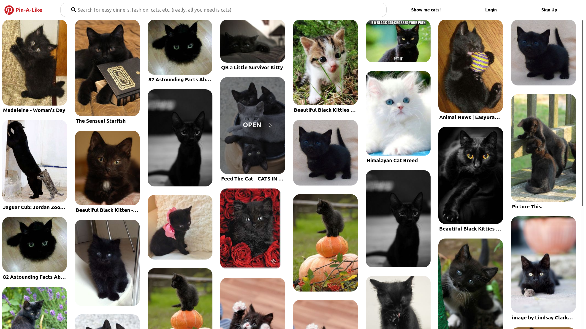

# Pin-A-Like
A Pinterest Clone to highlight infinite scrolling.

## Features
* * *
### Infinite Scrolling 


### Pinterest-Style Grid


### Resizeable Pin Grid


## Getting Started
* * *
### Dependencies
These programs are needed before installation: 
* Node.js
* A web browser

### Installing

* Fork and clone this repo to your local machine. To clone, enter:
```
git clone https://github.com/knrodriguez/Pin-A-Like.git
```
* Open the directory for this project in a terminal or editor of your choice.

### Executing program

* Install the dependencies required to run Pin-A-Like by running in the terminal:
```bash
npm install
```
* To run the program, enter:
```bash
npm start
```
* To interact with Pin-A-Like, enter into your browser's URL bar `localhost:3000`.

## Help
* * *
Any advise for common problems or issues.
```
command to run if program contains helper info
```d

## Authors

Kirstie Rodriguez 
[@DomPizzie](https://twitter.com/dompizzie)

## Version History
* * *
* 0.2
    * Various bug fixes and optimizations
    * See [commit change]() or See [release history]()
* 0.1
    * Initial Release

## License
* * *
This project is licensed under the [NAME HERE] License - see the LICENSE.md file for details

## Acknowledgments
* * *
Inspiration, code snippets, etc.
* [awesome-readme](https://github.com/matiassingers/awesome-readme)
* [PurpleBooth](https://gist.github.com/PurpleBooth/109311bb0361f32d87a2)
* [dbader](https://github.com/dbader/readme-template)
* [zenorocha](https://gist.github.com/zenorocha/4526327)
* [fvcproductions](https://gist.github.com/fvcproductions/1bfc2d4aecb01a834b46)